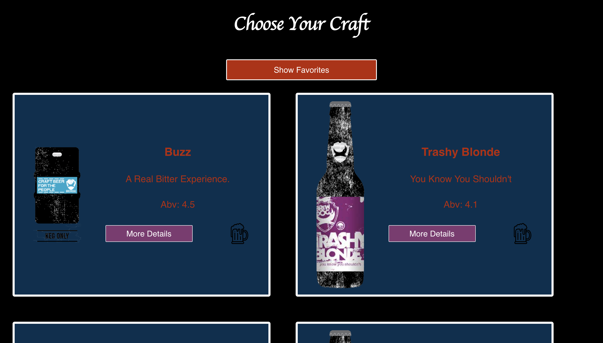

# Choose Your Craft

## Author - Naomi Campos

## Overview
This app allows the user to view a list of beers and click on the 'more details' button to see additional information and a beer mug icon to indicate a favorite beer. The user can also click the 'show favorites' button at the top of the page to only see the beers they have favorited.

## Setup
- Clone down repository
- Run 'npm install' in terminal
- Run 'npm start' and go to 'http://localhost:3000/' in browser

## Future Goals
- Complete functionality to indicate to user that a beer has been favorited
- List beer ingredients and food pairing suggestions on details page
- Create more appealing design
- Complete testing coverage

## Tech 
- React
- Redux
- React Router
- Jest
- Enzyme
- CSS

## Screenshots
#### Home Page

#### Details Page

#### Showing Favorites

### Link to Project Board
https://github.com/NaomiKC92/choose-your-craft/projects

